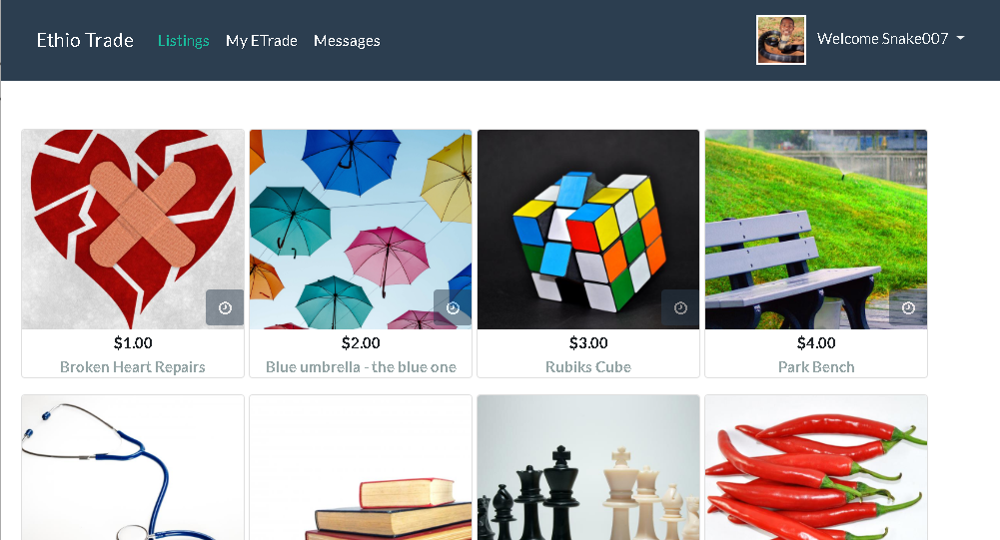

# Ethio Trade
Web Application for buying and selling goods - Developed with ASP .Net Core 3.0 & Angular 8 and Hosted with Azure.

### Setup & Run
1. Install [dependencies](#Dependencies)
2. Launch _terminal/cmd_ clone repo: `git clone https://github.com/lenzoburger/EthioTrade.git`
3. Change current directory `cd EthioTrade`
4. Run setup `npm run setup`
5. Start application `npm start`
6. Browser will launch at http://localhost:4200 
   * ... _if not, launch browser and navigate to [URL](http://localhost:4200)_
7. Visit http://localhost:5000/swagger for EthioTrade-Api SwaggerUi & documentation

### Dependencies
1. [Dotnet-sdk (v3.0+)](https://dotnet.microsoft.com/download)
2. [Node (v10+)](https://nodejs.org/en/download)
3. [AngularCLi (v8+)](https://cli.angular.io/) `npm install -g @angular/cli`
4. [Git](https://git-scm.com/downloads)

### Tools
1. [Git Extensions](https://github.com/gitextensions/gitextensions/releases)
2. [Postman](https://www.getpostman.com/downloads)
3. [SQLLite.DB.Browser](https://sqlitebrowser.org/dl)
4. [Visual Studio Code](https://code.visualstudio.com/download) & **Extensions:**
   * [_Angular Files_](https://marketplace.visualstudio.com/items?itemName=alexiv.vscode-angular2-files)
   * [_Angular Language Service_](https://marketplace.visualstudio.com/items?itemName=Angular.ng-template)
   * [_Angular Snippets_](https://marketplace.visualstudio.com/items?itemName=johnpapa.Angular2)
   * [_angular2-switcher_](https://marketplace.visualstudio.com/items?itemName=infinity1207.angular2-switcher)
   * [_Auto Rename Tag_](https://marketplace.visualstudio.com/items?itemName=formulahendry.auto-rename-tag)
   * [_Bracket Pair Colorizer 2_](https://marketplace.visualstudio.com/items?itemName=CoenraadS.bracket-pair-colorizer-2)
   * [_C#_](https://marketplace.visualstudio.com/items?itemName=ms-vscode.csharp)
   * [_C# Extensions_](https://marketplace.visualstudio.com/items?itemName=jchannon.csharpextensions)
   * [_Debugger for chrome_](https://marketplace.visualstudio.com/items?itemName=msjsdiag.debugger-for-chrome)
   * [_Markdown All in One_](https://marketplace.visualstudio.com/items?itemName=yzhang.markdown-all-in-one)
   * [_Markdown Preview Enhanced_](https://marketplace.visualstudio.com/items?itemName=shd101wyy.markdown-preview-enhanced)
   * [_Meterial Icon Theme_](https://marketplace.visualstudio.com/items?itemName=PKief.material-icon-theme)
   * [_Nuget Package Manger_](https://marketplace.visualstudio.com/items?itemName=jmrog.vscode-nuget-package-manager)
   * [_Path Intellisense_](https://marketplace.visualstudio.com/items?itemName=christian-kohler.path-intellisense)
   * [_Prettier - Code Formatter_](https://marketplace.visualstudio.com/items?itemName=esbenp.prettier-vscode)
   * [_TSLint_](https://marketplace.visualstudio.com/items?itemName=ms-vscode.vscode-typescript-tslint-plugin)
